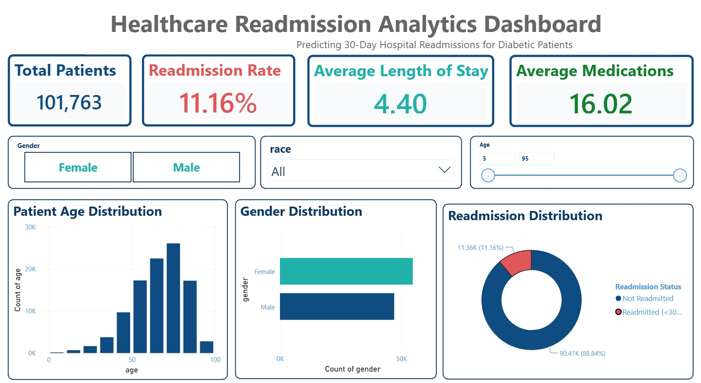
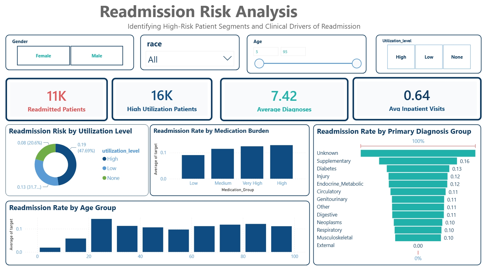
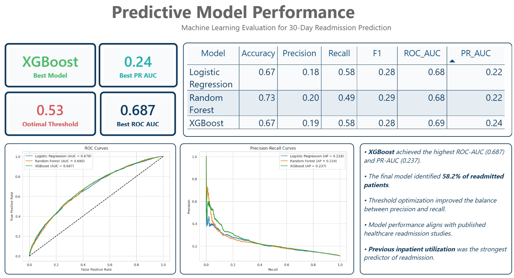
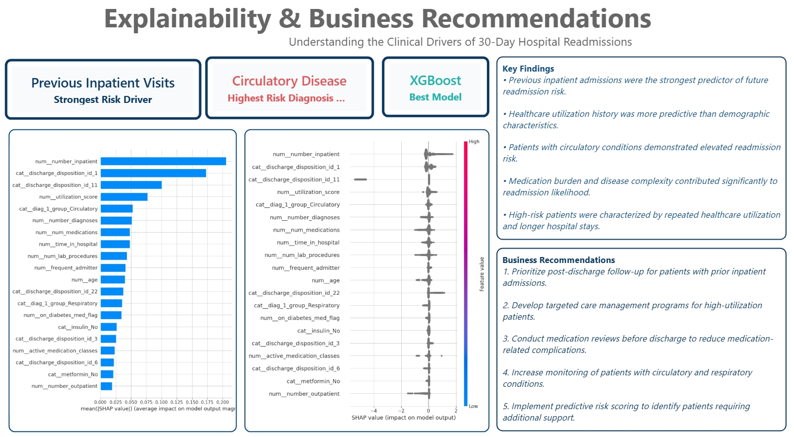

<div align="center">

# 🏥 Healthcare Readmission Analytics Dashboard

### Predicting 30-Day Hospital Readmissions Using Machine Learning, Explainable AI & Business Intelligence


</div>

---

# 📑 Table of Contents

- Executive Summary
- Business Problem
- Dataset Overview
- Project Architecture
- Feature Engineering
- Machine Learning Models
- Dashboard Overview
- Explainable AI Analysis
- Key Findings
- Business Recommendations
- Conclusion
- Technology Stack
- Repository Structure
- Future Improvements

---

# 🎯 Executive Summary

Healthcare systems face significant financial and operational burdens due to avoidable hospital readmissions.

This project develops an end-to-end predictive analytics framework capable of identifying diabetic patients at risk of 30-day readmission while providing explainable insights into the underlying clinical drivers.

---

## 🔥 Project Highlights

| KPI | Value |
|------|------|
| Patients Analyzed | 101,763 |
| Readmission Rate | 11.16% |
| Average Length of Stay | 4.40 Days |
| Average Medications | 16.02 |
| Best Model | XGBoost |
| ROC-AUC | 0.687 |
| PR-AUC | 0.237 |
| Recall | 58.2% |

---

# 💼 Business Problem

Hospital readmissions negatively impact:

- Patient outcomes
- Healthcare costs
- Resource allocation
- Hospital performance metrics

Healthcare providers require predictive systems capable of identifying high-risk patients before discharge.

---

# 📊 Dataset Overview

## Source

UCI Diabetes 130-US Hospitals Dataset

## Scope

| Metric | Value |
|----------|----------|
| Hospitals | 130 |
| Encounters | 101,763 |
| Domain | Healthcare |
| Target | Readmitted <30 Days |
| Population | Diabetic Patients |

---

# ⚙️ Project Architecture

```text
Raw Hospital Data
        │
        ▼
 Data Cleaning
        │
        ▼
 Feature Engineering
        │
        ▼
 Model Development
        │
 ┌───────────────┐
 │ Logistic Reg. │
 │ Random Forest │
 │   XGBoost     │
 └───────────────┘
        │
        ▼
 Model Evaluation
        │
        ▼
 SHAP Explainability
        │
        ▼
 Power BI Dashboard
        │
        ▼
 Business Recommendations
````

---

# 🧠 Feature Engineering

Several healthcare-specific features were engineered to improve predictive performance.

| Feature                  | Purpose                       |
| ------------------------ | ----------------------------- |
| Utilization Score        | Healthcare usage intensity    |
| Frequent Admitter Flag   | Repeat admission history      |
| Medication Burden        | Treatment complexity          |
| Diagnosis Groups         | Clinical categorization       |
| Length of Stay Flag      | Hospitalization severity      |
| Diabetes Medication Flag | Treatment adherence indicator |

---

# 🤖 Machine Learning Models

## Models Evaluated

| Model               | Accuracy | Precision | Recall | F1   | ROC-AUC | PR-AUC |
| ------------------- | -------- | --------- | ------ | ---- | ------- | ------ |
| Logistic Regression | 0.67     | 0.18      | 0.58   | 0.28 | 0.68    | 0.22   |
| Random Forest       | 0.73     | 0.20      | 0.49   | 0.29 | 0.68    | 0.22   |
| XGBoost             | 0.67     | 0.19      | 0.58   | 0.28 | 0.69    | 0.24   |

---

## 🏆 Best Performing Model

# XGBoost

| Metric            | Score |
| ----------------- | ----- |
| ROC-AUC           | 0.687 |
| PR-AUC            | 0.237 |
| Recall            | 58.2% |
| Precision         |18.7%|
| Optimal Threshold | 0.53  |

---

# 📈 Dashboard Overview

---

## 📍 Page 1 — Executive Summary

### Purpose

Provides a high-level overview of the patient population and readmission statistics.

### KPIs

* Total Patients
* Readmission Rate
* Average Length of Stay
* Average Medications

### Visualizations

* Patient Age Distribution
* Gender Distribution
* Readmission Distribution

### Executive Summary


---

## 📍 Page 2 — Readmission Risk Analysis

### Purpose

Identify patient segments most vulnerable to readmission.

### Visualizations

* Readmission Risk by Utilization Level
* Readmission Rate by Medication Burden
* Readmission Rate by Age Group
* Readmission Rate by Diagnosis Group





---

## 📍 Page 3 — Predictive Model Performance

### Purpose

Compare machine learning models and evaluate predictive effectiveness.

### Visualizations

* ROC Curves
* Precision Recall Curves
* Model Comparison Table
* Performance KPIs




---

## 📍 Page 4 — Explainability & Business Recommendations

### Purpose

Provide transparency into model predictions and convert insights into business actions.

### Visualizations

* SHAP Feature Importance
* SHAP Summary Plot
* Key Findings
* Strategic Recommendations




---

# 🔬 Explainable AI Analysis

### Top Clinical Drivers of Readmission

| Rank | Clinical Driver |
|--------|----------------|
| 1 | Previous Inpatient Visits |
| 2 | Discharge Disposition |
| 3 | Healthcare Utilization Score |
| 4 | Circulatory Disease Diagnosis |
| 5 | Number of Diagnoses |
---

# 📌 Key Findings


### Clinical Insights

✔ Previous inpatient admissions were the strongest predictor of future readmission risk.

✔ Healthcare utilization history was more predictive than demographic characteristics.

✔ Patients with circulatory diseases demonstrated elevated readmission risk.

✔ Medication burden and disease complexity contributed significantly to readmission likelihood.

✔ High-risk patients were characterized by repeated healthcare utilization and longer hospital stays.

---

## Machine Learning Insights

✔ XGBoost achieved the highest ROC-AUC and PR-AUC.

✔ Threshold optimization improved sensitivity to high-risk patients.

✔ Explainability outputs aligned with clinical intuition.

✔ Feature importance highlighted actionable intervention points.

---

# 🚀 Business Recommendations

## 1. Post-Discharge Follow-Up Programs

Prioritize patients with previous inpatient admissions, as prior hospitalization history was identified as the strongest predictor of future readmissions. Early follow-up appointments and care coordination can reduce avoidable returns.

---

## 2. High Utilization Care Management

Develop targeted care management programs for high-utilization patients. Personalized intervention plans can help reduce unnecessary healthcare utilization and improve long-term patient outcomes.

---

## 3. Medication Reconciliation & Review

Implement comprehensive medication reviews before discharge to minimize medication-related complications and improve treatment adherence among patients with complex medication regimens.

---

## 4. Enhanced Monitoring for High-Risk Conditions

Increase post-discharge monitoring and support for patients diagnosed with circulatory and respiratory conditions, which demonstrated elevated readmission risk within the population.

---

## 5. Predictive Risk Scoring Deployment

Integrate machine learning–based risk scoring into clinical workflows to proactively identify high-risk patients and allocate resources before readmission occurs.

---


## 🎯 Conclusion

This project developed an end-to-end healthcare analytics solution to predict 30-day hospital readmissions among diabetic patients.

After evaluating multiple machine learning models, XGBoost achieved the strongest overall performance with a ROC-AUC of 0.687 and PR-AUC of 0.237. Explainable AI analysis using SHAP revealed that previous inpatient visits, discharge disposition, utilization score, and disease complexity were the most influential predictors of readmission risk.

The interactive Power BI dashboard translates these insights into actionable visualizations, enabling healthcare stakeholders to identify high-risk patients, understand clinical risk factors, and support data-driven intervention strategies aimed at reducing preventable readmissions.

---

## 🛠️ Tech Stack

| Tool | Purpose |
|------|----------|
| Power BI | Dashboard Development |
| Python | Data Processing |
| Pandas | Feature Engineering |
| Scikit-Learn | Machine Learning |
| XGBoost | Final Model |
| SHAP | Explainable AI |

---

# 📂 Repository Structure

```text
Healthcare-Readmission-Analytics
│
├── data
│
├── notebook
│
├── models
│
├── dashboard
│   └── Healthcare_Readmission_Dashboard.pbix
│
├── images
│   ├── executive_summary.png
│   ├── risk_analysis.png
│   ├── model_performance.png
│   └── explainability.png
│
├── README.md
│
└── requirements.txt
```
---

# 🔮 Future Enhancements

* Real-Time Readmission Risk Scoring
* Azure Deployment
* Streamlit Application
* Automated Model Retraining
* Clinical Decision Support Integration

---

# 👩‍💻 Author

## Shaik Afsar Jahan 

Healthcare Analytics • Data Science • Machine Learning • Business Intelligence

---

<div align="center">

### ⭐ If you found this project useful, consider starring the repository.

### Thank you for visiting!

</div>
```
